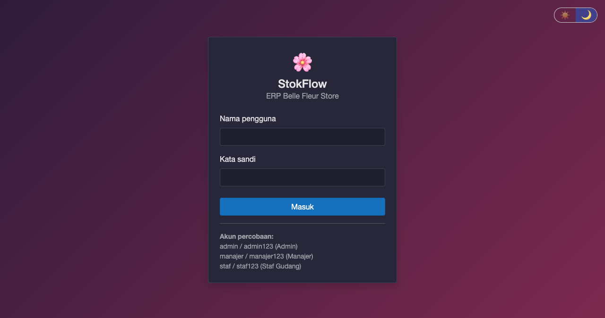
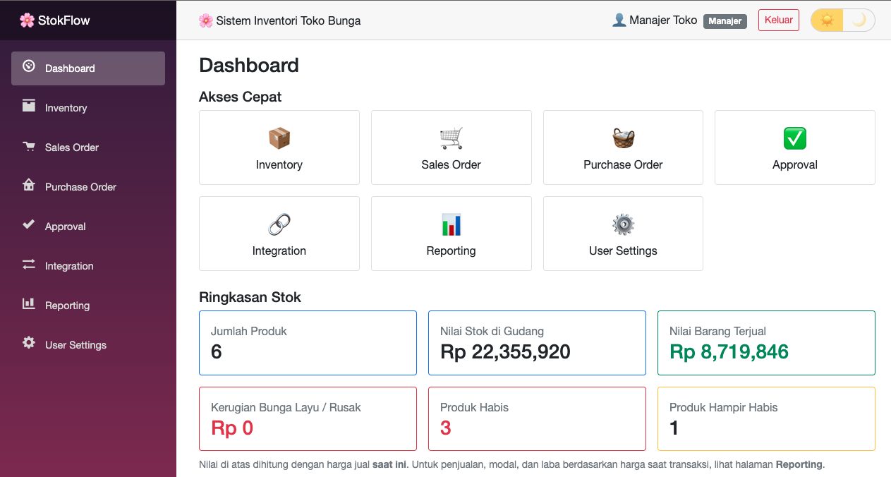
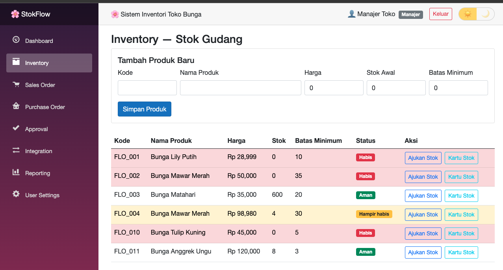
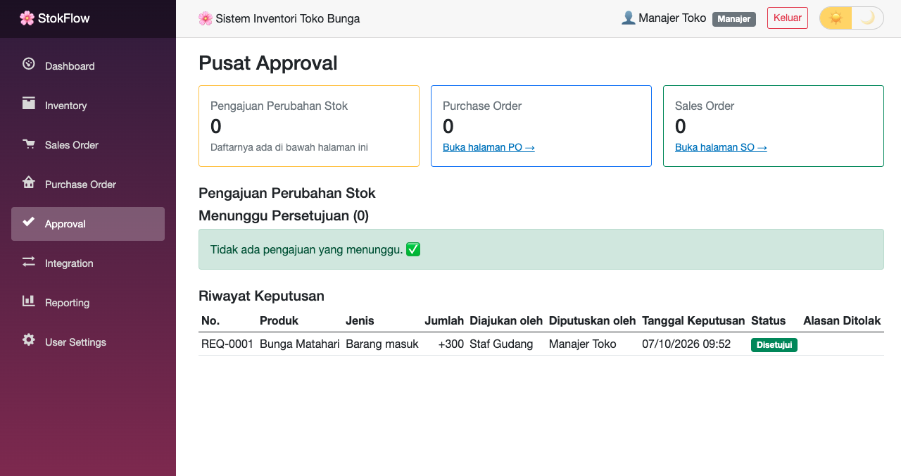
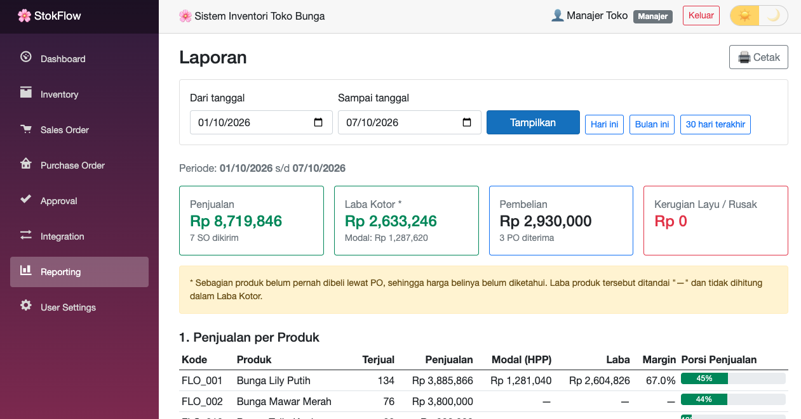

# 🌸 StokFlow — Mini-ERP Toko Bunga

Aplikasi web **mini-ERP** untuk toko bunga, dibangun dengan **C#, Blazor Server, dan Entity Framework Core**.
Mencakup inventory dengan kartu stok, alur persetujuan (approval), Purchase Order, Sales Order,
laporan laba, ekspor/impor Excel, dan REST API.

Proyek ini terinspirasi dari pengalaman saya mengembangkan modul inventory, sales order, reporting,
dan approval (Power Apps) untuk **Microsoft Dynamics 365**. Di sini saya membangun ulang alur-alur
tersebut dari nol dengan .NET.

---

## 📸 Tampilan

| Login | Dashboard |
|---|---|
|  |  |

| Tema Gelap | Inventory & Kartu Stok |
|---|---|
|  |  |

| Pusat Approval | Purchase Order |
|---|---|
|  |  |

| Sales Order | Reporting |
|---|---|
|  |  |

---

## ✨ Modul & Fitur

| Modul | Fitur |
|---|---|
| **Login & Peran** | Admin, Manajer, Staf Gudang. Kata sandi disimpan sebagai *hash*. Menu, halaman, dan service dijaga sesuai peran. |
| **Inventory** | Status stok otomatis (Aman / Hampir habis / Habis). **Kartu stok** mencatat setiap perubahan beserta nomor dokumen sumbernya. |
| **Approval** | Perubahan stok wajib diajukan dan disetujui. **Pusat Approval** menampilkan semua pengajuan, PO, dan SO yang menunggu. |
| **Purchase Order** | Dokumen header-detail, master data pemasok, approval, lalu **penerimaan barang otomatis menambah stok**. |
| **Sales Order** | Master data pelanggan, **persetujuan berdasarkan nilai** (≤ Rp 1 juta otomatis), lalu **pengiriman otomatis mengurangi stok**. |
| **Reporting** | Penjualan, **modal (HPP)**, **laba kotor**, margin, per pelanggan/pemasok, kerugian barang layu, nilai stok. Filter tanggal dan cetak/PDF. |
| **User Settings** | Ganti kata sandi; Admin bisa menambah pengguna, mengubah peran, reset kata sandi, dan menonaktifkan akun. |
| **Integration** | **Ekspor CSV** (produk, kartu stok, SO, PO), **impor produk dari CSV** dengan validasi per baris, dan **REST API** baca-saja dengan API key. |
| **Tampilan** | Tema terang/gelap (☀️ / 🌙) yang diingat browser. |

## 🔒 Aturan Bisnis yang Diterapkan

- Stok **tidak bisa diubah langsung**; hanya lewat pengajuan yang disetujui, penerimaan PO, atau pengiriman SO.
- **Pemisahan tugas (segregation of duties)**: pembuat dokumen tidak boleh menyetujui dokumennya sendiri.
- Stok **diperiksa ulang** saat persetujuan dan saat pengiriman, karena bisa berubah sejak dokumen dibuat.
- Perubahan status dokumen, stok, dan kartu stok disimpan dalam **satu transaksi** (semua berhasil atau semua batal).
- Nama produk, harga jual, dan harga beli disimpan sebagai **snapshot** di setiap dokumen.
- Hak akses diperiksa **tiga lapis**: menu, halaman, dan service.
- Pengguna **dinonaktifkan, bukan dihapus** (*soft delete*), agar jejak audit di dokumen tetap utuh.
- Sistem selalu menyisakan **minimal satu Admin aktif**.
- Laba hanya dihitung untuk produk yang harga belinya diketahui, supaya laporan **tidak menyesatkan**.

## 🛠️ Teknologi

| Bagian | Teknologi |
|---|---|
| Bahasa | C# |
| Framework | .NET 7, Blazor Server, Minimal API |
| Database | SQLite + Entity Framework Core 7 |
| Tampilan | Bootstrap 5, CSS isolation, JS Interop |
| Keamanan | AuthenticationStateProvider kustom, PasswordHasher, role-based authorization, API key |

## 📁 Struktur Proyek

```
StokFlow.Web
├── Api/        → endpoint REST API
├── Auth/       → status login & pembantu data pengguna
├── Data/       → AppDbContext (jembatan ke database)
├── Models/     → entity & aturan bisnis (Product, StockRequest, PurchaseOrder, SalesOrder, ...)
├── Services/   → logika aplikasi (Inventory, Approval, PurchaseOrder, SalesOrder, Report, Csv, User)
├── Pages/      → halaman Blazor
├── Shared/     → layout, menu, komponen yang dipakai ulang
├── wwwroot/    → CSS & JavaScript
└── docs/       → tangkapan layar
```

**Prinsip:** aturan bisnis berada di dalam entity (contoh: `Product.StockOut()` menolak stok minus),
service mengatur alur dan penyimpanan, sedangkan halaman hanya mengurus tampilan.

## ▶️ Cara Menjalankan

1. Pasang **.NET 7 SDK** atau lebih baru.
2. Jalankan:
```
   dotnet run
```
3. Buka alamat yang muncul di terminal (contoh: `http://localhost:5016`).
4. Database SQLite dan data contoh dibuat otomatis saat pertama kali dijalankan.

**Akun percobaan:**

| Peran | Nama pengguna | Kata sandi |
|---|---|---|
| Admin | `admin` | `admin123` |
| Manajer | `manajer` | `manajer123` |
| Staf Gudang | `staf` | `staf123` |

## 🔌 Contoh Pemakaian API

```
curl -H "X-API-Key: stokflow-demo-key-123" http://localhost:5016/api/low-stock
```

| Endpoint | Isi |
|---|---|
| `GET /api/products` | Semua produk & stok |
| `GET /api/products/{kode}` | Satu produk |
| `GET /api/products/{kode}/movements` | Kartu stok satu produk |
| `GET /api/low-stock` | Produk yang perlu dibeli lagi |

> Kunci API di `appsettings.json` hanya untuk demo. Untuk produksi, kunci disimpan di environment variable.

## 🗺️ Rencana Pengembangan

- [ ] Reservasi stok saat Sales Order disetujui
- [ ] Penerimaan barang sebagian (partial receipt) pada Purchase Order
- [ ] EF Core Migrations menggantikan `EnsureCreated`
- [ ] Unit test untuk aturan bisnis
- [ ] Migrasi ke .NET 8/10 dan ASP.NET Core Identity
- [ ] Dokumentasi API otomatis (Swagger) dan rate limiting